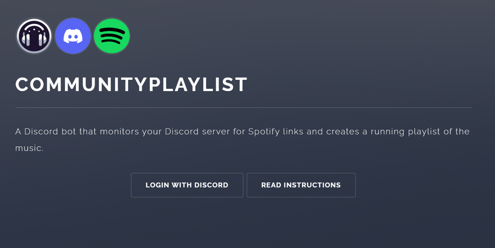

# CommunityPlaylist

A Python Discord bot that monitors your Discord server for Spotify links and creates a running playlist of the music.


## Features

- Automatically builds a Spotify playlist from song links posted in Discord
- Built with `discord.py` and `spotipy`
- Includes a Flask/Quart web frontend for management and Spotify authentication
- Secure: uses `quart_discord` for Discord login (no credentials stored), and `pynacl` to encrypt Spotify tokens
- FastAPI powers internal API communication between the bot and web frontend
- Full multi-user support; scalable and designed as a public-facing app
- Currently in invite-only mode while awaiting Spotify app approval

https://communityplaylist.org




## Bot Commands

- `!get_playlist` — Retrieve the current server playlist
- All other setup and configuration is handled via the web interface

## How To Run Yourself:
Steps to setup and run this code

- use setup.sh to create a mysql server with database named "discord" and correct schema
- use pipsetup.sh to ensure you have all the correct python libraries
- create a .env file in the root of this repo with the below data (both the web and bot look at the same .env file in root)
```
DISCORD_TOKEN=
DISCORD_CLIENT_ID=
DISCORD_CLIENT_SECRET=
MYSQL_USER=discord
MYSQL_PASS=
SPOTIPY_CLIENT_ID=
SPOTIPY_CLIENT_SECRET=
DISCORD_URL= "<url to add bot to discord server>"
DISCORD_CLIENT_REDIRECT_URL="<url>/callback_D"
CALLBACK="<url>/callback"
PORT = "8080"
INVITED = '["<discord_user_id>", "<discord_user_id>"]'
ENKEY = "<encryption key for pynacl>"
```
- run `cd web; bash ./start_webserver.sh` to start website
- run `cd bot; python3 CommunityPlaylistbot.py` to start the bot
- navigate to the web interface to add your bot to a server and test

## TODO:
- [x] Add web frontent to manage authentication
- [x] Use discord.py's Cogs for commands
- [x] sql connection
- [x] clean up sql code and architecture
- [x] streamline spotify authentication (using web frontend)
- [x] add ability to see login info on web frontend, and in turn, confirm your authentication data is removed
- [x] Update readme with new howto info
- [x] Store Spotify keys in db and encrypt them
- [x] redesign database schema
- [ ] update to discords built in command prefix stuff
- [ ] Make better setup script
- [ ] add testing
- [ ] add automated deploying/updating
- [ ] add automated testing
- [ ] update pictures on website


